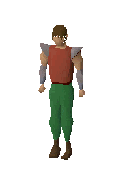
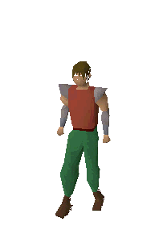
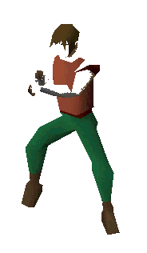
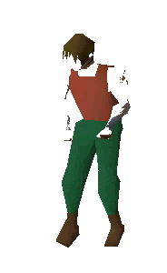
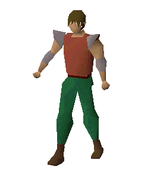

<p align="center">
  
  
  
</p>

<h1 align="center">🥔 Potato Scores</h1>

<p align="center">
  <strong>Old School RuneScape Hiscores — but for friends who talk mad smack about their stats.</strong>
</p>

<p align="center">
  <a href="https://rs-compare.vercel.app"><strong>▶ LIVE AT rs-compare.vercel.app</strong></a>
</p>

<p align="center">
  
  
</p>

---

## What is this?

Three accounts enter. One leaves with a party hat. 🎉

**Potato Scores** compares the official OSRS hiscores for:

| Player | Vibe |
|--------|------|
| **Veizon** | Probably the main |
| **trp_zero** | Zero chill, max stats |
| **JelloBeanMan** | Jiggly but dangerous |

Refresh the page. Watch the header emotes change. Click a name. Witness the level-up animation. Question your life choices at 3am while comparing Mining ranks.

> *"Buying gf" — no. Comparing XP gaps — yes.*

---

## Features (the good stuff)

### 🕺 Random header emotes
Every page load picks random dance GIFs on both sides of the title. Left one is mirrored so everyone's facing the potato.

Supported emotes:
- Dance
- Jig
- Crazy dance
- Smooth dance
- Crab dance *(peak content)*

### ⚔️ Combat level showdown
Player cards are sorted by **combat level** (official Jagex formula). Highest combat gets the golden card treatment.

### 🎉 Party hat for the leader
Whoever's winning combat gets a **blue party hat** next to their name. Flex granted. Ties get nothing — OSRS is cruel like that.

### 📊 Skill comparison table
Side-by-side levels, XP, and ranks for every skill. Winners highlighted in green. Passive-aggressive energy included free of charge.

### 🏆 Largest Level Lead
A banner calls out the **biggest skill gap** between any two players — e.g. *"Veizon leads Mining by 12 levels"*. That row glows in the table. Read it and weep.

### 📂 Category tabs
Filter skills like you're organizing your bank:
- **All**
- **Combat**
- **Gathering**
- **Artisan**
- **Support**

### 🔍 Player detail view
Click a player card (or their name) for the deep dive:
- XP to next level
- XP to 99
- Full skill breakdown

Comes with a satisfying **"Stats!"** level-up burst animation because we couldn't add the actual ding sound without Jagex sending a letter.

### 📱 Mobile friendly
Even works on iPhone mini. We fought the CSS `display: none` boss and won.

---

## High-level codebase (for the nerds)

It's a **static site + tiny serverless API**. No database. No login. Just potatoes and pride.

```
rs-compare/
├── index.html          # The page. Parchment panels. Vibes.
├── styles.css          # OSRS stone + parchment theme
├── app.js              # All the frontend logic (fetch, render, tabs, animations)
├── api/
│   ├── hiscore.js      # Single-player proxy → Jagex
│   └── hiscores.js     # Batch proxy (all 3 players, one request)
├── lib/
│   └── hiscore.js      # Jagex fetch logic, CSV fallback, timeouts
├── public/
│   ├── emotes/         # Dance GIFs (backgrounds removed, transparency fixed)
│   ├── icons/          # Skill icons + party hat + combat (local, no wiki hotlink drama)
│   └── *.gif/jpg       # OSRS UI assets (paper, buttons, stone bg)
└── vercel.json         # Deploy config
```

### How data flows

```
Browser  →  /api/hiscores?players=Veizon,trp_zero,JelloBeanMan
                ↓
         Vercel serverless (lib/hiscore.js)
                ↓
         Jagex official hiscores API
                ↓
         JSON/CSV parsed → skills, levels, XP, ranks
                ↓
         app.js renders cards + table + gap highlight
```

The browser **can't** call Jagex directly (CORS says no). So we proxy through Vercel with a 6s timeout, JSON-first with CSV fallback, and short caching so Jagex doesn't hate us.

### Routing

Player detail pages use hash routing: `#/player/Veizon` — no separate HTML file, just JS view swapping. Browser back button works. Very 2007. Very OSRS.

---

## Live deployment

| Thing | Where |
|-------|-------|
| **Production** | [https://rs-compare.vercel.app](https://rs-compare.vercel.app) |
| **Hosting** | [Vercel](https://vercel.com) |
| **Data source** | [Official OSRS Hiscores](https://secure.runescape.com/m=hiscore_oldschool/) |

Deploy updates:

```bash
npx vercel --prod
```

---

## Run locally

```bash
# Static files only — API won't work without Vercel
python3 -m http.server 8080

# Full experience (recommended)
npx vercel dev
```

Then open `http://localhost:3000` (or whatever Vercel dev prints).

---

## Random events (things that might happen)

- **Jagex API slow?** You'll see "Loading hiscores from Lumbridge..." for a bit. Classic Jagex delay energy.
- **504 timeout?** Their servers are having a moment. Hit Refresh. Sacrifice a potato at the GE altar.
- **Emote backgrounds haunted?** We ImageMagick'd them into transparency. If you see tan squares, report it — the crab dance is sensitive.

---

## Credits & disclaimers

- **Jagex / Old School RuneScape** — all game assets, hiscore data, and the concept of grinding forever belong to them. This is a fan project for friends, not affiliated with Jagex.
- **OSRS Wiki** — original emote GIF sources and icon references.
- **You** — for refreshing the page one more time to see if you're still losing to trp_zero in Fishing.

---

<p align="center">
  
  <br>
  <em>May the best potato win.</em>
  <br><br>
  
</p>
